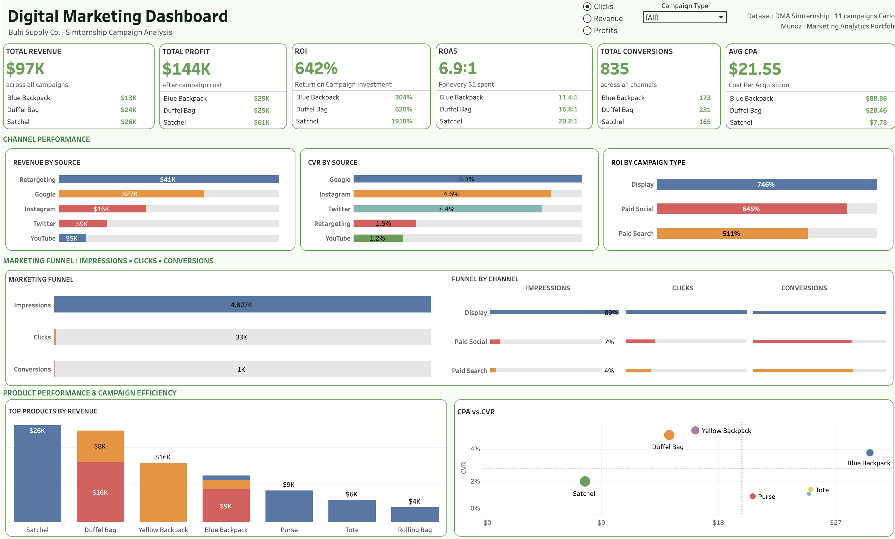

# Buhi Supply Co. — Digital Marketing Dashboard

**Campaign Performance Analysis · DMA Simternship**

---

## Overview

This interactive Tableau dashboard analyzes digital marketing campaign performance for **Buhi Supply Co.**, a bag and accessory brand, using data from the **DMA Simternship** simulation platform.

The dashboard was built to answer a core marketing question: **which campaigns and channels should be prioritized to maximize return on digital marketing spend** — and how does that answer change depending on whether the business is optimizing for clicks, revenue, or profit?

---

## The Business Problem

Buhi Supply Co. ran 11 campaigns across four channels — Display, Paid Search, Paid Social, and Affiliate — with varying budgets, reach, and conversion outcomes. The challenge was to cut through the volume of campaign data and surface the clearest signal: where is each dollar working hardest?

---

## Dashboard Preview

**[View Live Dashboard on Tableau Public →](#)**

---

## What I Built

The dashboard is organized into four sections:

**KPI Row**
Six headline metrics with Top 3 product breakdowns beneath each tile:
- Total Revenue · Total Profit · ROI% · ROAS · Total Conversions · Avg CPA

**Channel Performance**
- Revenue by Source — horizontal bar chart showing revenue contribution by channel
- CVR by Source — conversion rate comparison across channels
- ROI by Campaign Type — Display vs. Paid Social vs. Paid Search

**Marketing Funnel**
- Full-funnel view: Impressions → Clicks → Conversions with dual-axis progress bars
- Funnel by Channel table showing impression share, click share, and conversion share side by side

**Product Performance & Campaign Efficiency**
- Top Products by Revenue — stacked bar showing revenue split by scenario
- CPA vs. CVR Scatter — efficiency quadrant identifying star campaigns (low cost, high conversion)

**Scenario Selector**
A parameter-driven button row lets users toggle between three optimization scenarios — Clicks, Revenue, Profits — updating all views simultaneously without rebuilding.

---

## Key Findings

- **Satchel via Retargeting** is the highest-efficiency campaign — lowest CPA at $7.78, highest ROAS at 20.2:1
- **Display owns 89% of impressions** but delivers a fraction of conversions — Paid Search converts more efficiently from far fewer impressions
- **Overall ROAS: 6.9:1** — every $1 spent returned $6.90 in revenue across all campaigns
- **Google and Instagram lead on CVR** at 5.3% and 4.6% respectively — outperforming Retargeting and YouTube despite lower impression volume
- **ROI by campaign type**: Display 746%, Paid Social 645%, Paid Search 511% — Display leads on return but requires the largest budget commitment

---

## Recommendation

Shift 15–20% of Display impression budget toward Paid Search — specifically Google campaigns for Duffel Bag and Satchel. Retargeting is the highest performer per dollar. Increasing its allocation while maintaining the current product mix would likely push ROAS above 8:1 in the next campaign cycle.

---

## Calculated Fields

| Field | Formula |
|---|---|
| ROAS | `SUM([Revenue]) / SUM([Cost])` |
| ROI% | `(SUM([Revenue]) - SUM([Cost])) / SUM([Cost])` |
| Avg CPA | `SUM([Cost]) / SUM([Conversions])` |
| Scenario Active | Compound IF matching parameter value to Table Name for button highlighting |
| Funnel Track | Hardcoded constant for dual-axis progress bar background |

---

## Tools & Skills

Tableau Public · Data Union (3 CSV files) · Parameter Controls · Dashboard Actions · Dual-Axis Charts · Calculated Fields · Funnel Analysis · Scatter Plot · ROAS / CPA / CVR / ROI · Marketing Analytics

---

## Data Source

**DMA Simternship** — Digital Marketing Association simulation platform  
Three scenario files unioned in Tableau: Clicks optimization · Revenue optimization · Profits optimization  
11 campaigns · 4 channels · 7 products

*Data used for academic and portfolio purposes. All figures reflect simulated campaign performance.*

---

*Carlos Munoz · MS in Marketing Analytics, CSU East Bay · Marketing Analytics Portfolio*
